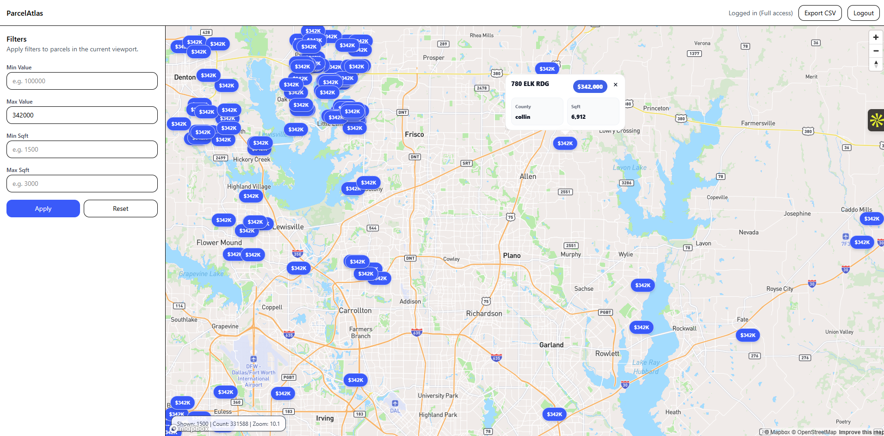

# ParcelAtlas Frontend

## Overview
ParcelAtlas Frontend is a React + TypeScript application for visualizing real estate parcels in the Dallas–Fort Worth area on an interactive Mapbox map. 
It supports guest browsing, authenticated access via AWS Cognito, polygon rendering at high zoom levels, persistent filters, and CSV export.

This frontend is designed as part of a take‑home project and focuses on clarity, correctness, and production‑ready structure.

---

## Hosted URLs (Live Demo)

### Frontend (Vercel)
https://parcel-atlas-frontend.vercel.app/

### Backend API (Render)
https://parcelatlas-backend.onrender.com/

---

## Features

- Interactive Mapbox map (centroids + polygons)
- Guest access (Dallas county only)
- Login / Signup via AWS Cognito (Hosted UI)
- Authenticated access to full dataset
- Price & square‑footage filters
- Filter persistence (guest + per‑user)
- CSV export (authenticated)
- Dockerized production build using Nginx

---

## Design Decisions

- Centroid rendering by default for performance
- Polygon rendering only at high zoom and low feature count
- LocalStorage used for filter persistence to avoid backend state
- Access token used for API auth; ID token avoided for backend calls

---

## Centroid vs Polygon Rendering Strategy

ParcelAtlas uses a **two-stage geometry rendering strategy** to balance performance and accuracy when visualizing large spatial datasets.

### Centroid Rendering (Default)

- Parcels are rendered as **point centroids** by default
- Used during:
  - Initial load
  - Low zoom levels
  - Large bounding boxes
- Optimized for:
  - Fast map interaction
  - Smooth panning & zooming
  - Low memory usage

This allows thousands of parcels to be displayed without overwhelming the browser.

---

### Polygon Rendering (High Zoom)

- Full parcel polygons are rendered **only when**:
  - User zooms in sufficiently
  - Parcel count within viewport is below a safe threshold
- Prevents:
  - Browser freezes
  - Excessive DOM / WebGL load
  - Slow redraws

Polygon rendering provides **accurate parcel boundaries** for detailed inspection without sacrificing overall performance.

---

### Why This Approach?

Rendering thousands of polygons simultaneously is expensive in Mapbox GL.
This hybrid strategy ensures:

- Excellent performance at scale
- Visual accuracy when needed
- Predictable client behavior
- Production-safe rendering

This design mirrors real-world GIS platforms used in commercial mapping applications.

---

## Tech Stack

- React 18
- TypeScript
- Vite
- Mapbox GL JS
- AWS Cognito (OAuth2 + PKCE)
- Docker + Nginx

---

## Project Structure

```
ParcelAtlas-Frontend/
├── public/
│   └── index.html
├── src/
│   ├── components/
│   │   ├── Header.tsx
│   │   ├── Sidebar.tsx
│   │   └── MapView.tsx
│   ├── lib/
│   │   ├── api.ts
│   │   ├── auth.ts
│   │   ├── filterStorage.ts
│   │   └── exportCsv.ts
│   │   └── types.ts
│   ├── pages/
│   │   ├── AuthCallback.tsx
│   │   └── Home.tsx
│   ├── styles/
│   │   └── map-popup.css
│   ├── main.tsx
├── Dockerfile
├── nginx.conf
├── .dockerignore
├── package.json
└── README.md
```

---

## Environment Variables

Create a `.env` file locally or provide build args in Docker.

```
VITE_API_BASE_URL=http://localhost:8080
VITE_MAPBOX_ACCESS_TOKEN=XXXXXXXXXXXXXXXXXXXXXXXX

AWS_REGION=XXX
COGNITO_USER_POOL_ID=XXXXXXXXXXX
VITE_COGNITO_CLIENT_ID=XXXXXXXXXXXXXX
VITE_COGNITO_DOMAIN=https://xxxxxxxxx.auth.us-east-2.amazoncognito.com
VITE_COGNITO_REDIRECT_URI=http://xxxxxxxxxxxx/auth/callback
VITE_COGNITO_LOGOUT_URI=http://xxxxxxxxxxxx:5173/
```

---

## Local Development

```
npm install
npm run dev
```

App runs at:
```
http://localhost:5173
```

---

## Docker Build & Run

### Build

```
docker build   --build-arg VITE_API_BASE_URL=http://localhost:8080   --build-arg VITE_MAPBOX_ACCESS_TOKEN=xxxxxxxxxxxxxx   --build-arg VITE_COGNITO_DOMAIN=https://xxxxxxxxx.auth.us-east-2.amazoncognito.com   --build-arg VITE_COGNITO_CLIENT_ID=xxxxxxxxxxxx  --build-arg VITE_COGNITO_REDIRECT_URI=http://xxxxxxxxx:5173/auth/callback   --build-arg VITE_COGNITO_LOGOUT_URI=http://xxxxxxt:5173/   -t parcelatlas-frontend .
```

### Run

```
docker run -p 5173:80 parcelatlas-frontend
```

---

## Authentication Flow

1. User clicks Login
2. Redirected to Cognito Hosted UI
3. Authorization code returned
4. PKCE token exchange
5. Tokens stored in localStorage
6. Access token sent to backend APIs

---

## Filter Persistence (ST‑04)

- Guest filters saved under:
  `pa_filters_guest`
- Authenticated filters saved under:
  `pa_filters_<cognito_sub>`
- Switching login/logout automatically switches filter scope

---

## CSV Export

Authenticated users can export filtered results as CSV.

---

## Screenshots

### Map View 


### Login View 


### Filter View 


---

## Quick Test

1. Open the frontend URL  
   → Map loads with parcel centroids visible

2. Pan the map as a guest  
   → Only **Dallas County** parcels are visible

3. Click **Login**  
   → Authenticate via AWS Cognito Hosted UI

4. After login, pan the map again  
   → Additional counties (Collin, Denton, etc.) appear

5. Apply filters (price / sqft)  
   → Parcels update in real time

6. Refresh the page  
   → Filters persist automatically

7. Click **Export CSV** (authenticated only)  
   → Filtered results download successfully

---

## Notes

- Frontend & backend are intentionally separated
- All environment values are configurable
- Dockerized for reproducible builds
- No mock data used; real PostGIS queries

---

## Author

Bhupesh Kumar  
Take‑Home Project Submission
