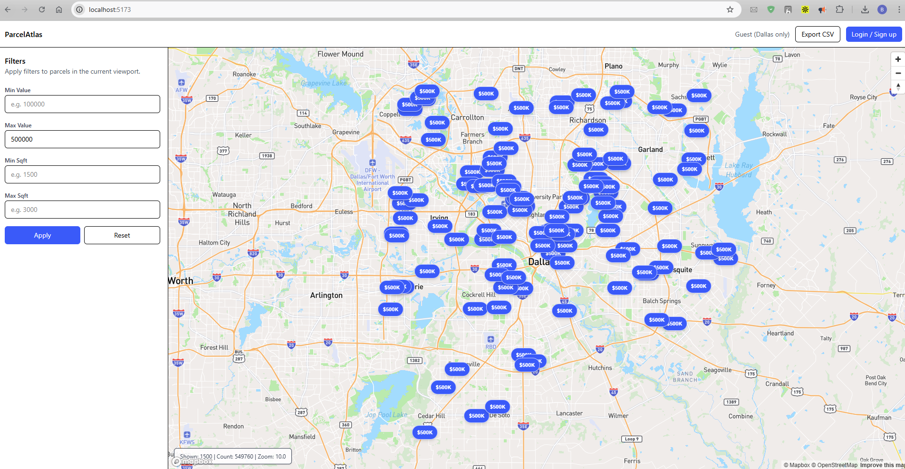
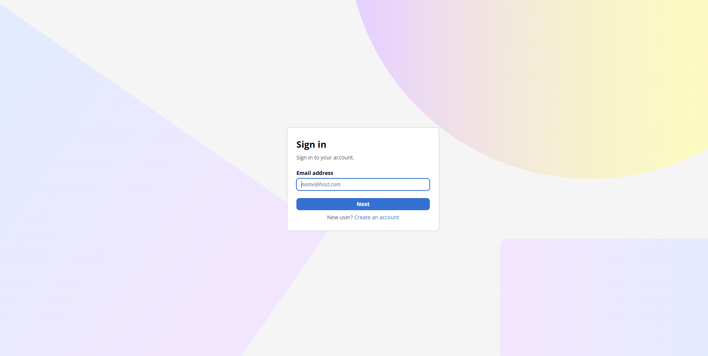

# ParcelAtlas Frontend

## Overview
ParcelAtlas Frontend is a React + TypeScript application for visualizing real estate parcels in the Dallas–Fort Worth area on an interactive Mapbox map. 
It supports guest browsing, authenticated access via AWS Cognito, polygon rendering at high zoom levels, persistent filters, and CSV export.

This frontend is designed as part of a take‑home project and focuses on clarity, correctness, and production‑ready structure.

---

## Features

- Interactive Mapbox map (centroids + polygons)
- Guest access (Dallas county only)
- Login / Signup via AWS Cognito (Hosted UI)
- Authenticated access to full dataset
- Price & square‑footage filters
- Filter persistence (guest + per‑user)
- CSV export (authenticated)
- Dockerized production build using Nginx

---

## Design Decisions

- Centroid rendering by default for performance
- Polygon rendering only at high zoom and low feature count
- LocalStorage used for filter persistence to avoid backend state
- Access token used for API auth; ID token avoided for backend calls


---

## Tech Stack

- React 18
- TypeScript
- Vite
- Mapbox GL JS
- AWS Cognito (OAuth2 + PKCE)
- Docker + Nginx

---

## Project Structure

```
ParcelAtlas-Frontend/
├── public/
│   └── index.html
├── src/
│   ├── components/
│   │   ├── Header.tsx
│   │   ├── Sidebar.tsx
│   │   └── MapView.tsx
│   ├── lib/
│   │   ├── api.ts
│   │   ├── auth.ts
│   │   ├── filterStorage.ts
│   │   └── exportCsv.ts
│   │   └── types.ts
│   ├── pages/
│   │   ├── AuthCallback.tsx
│   │   └── Home.tsx
│   ├── styles/
│   │   └── map-popup.css
│   ├── main.tsx
├── Dockerfile
├── nginx.conf
├── .dockerignore
├── package.json
└── README.md
```

---

## Environment Variables

Create a `.env` file locally or provide build args in Docker.

```
VITE_API_BASE_URL=http://localhost:8080
VITE_MAPBOX_ACCESS_TOKEN=pk.eyJ1IjoiYmh1cGVzaGt1bWFyIiwiYSI6ImNtbDIwZHNxMTBkNTYzZ3B2eXB0ZDdmMG4ifQ.tcPAyu1aZQ4G1B8E__yCUw

AWS_REGION=us-east-2
COGNITO_USER_POOL_ID=us-east-2_F4KqiXCV1
VITE_COGNITO_CLIENT_ID=1l5g4klnf8ugcs75hjasdqfn0e
VITE_COGNITO_DOMAIN=https://us-east-2f4kqixcv1.auth.us-east-2.amazoncognito.com
VITE_COGNITO_REDIRECT_URI=http://localhost:5173/auth/callback
VITE_COGNITO_LOGOUT_URI=http://localhost:5173/
```

---

## Local Development

```
npm install
npm run dev
```

App runs at:
```
http://localhost:5173
```

---

## Docker Build & Run

### Build

```
docker build   --build-arg VITE_API_BASE_URL=http://localhost:8080   --build-arg VITE_MAPBOX_ACCESS_TOKEN=pk.eyJ1IjoiYmh1cGVzaGt1bWFyIiwiYSI6ImNtbDIwZHNxMTBkNTYzZ3B2eXB0ZDdmMG4ifQ.tcPAyu1aZQ4G1B8E__yCUw   --build-arg VITE_COGNITO_DOMAIN=https://us-east-2f4kqixcv1.auth.us-east-2.amazoncognito.com   --build-arg VITE_COGNITO_CLIENT_ID=1l5g4klnf8ugcs75hjasdqfn0e   --build-arg VITE_COGNITO_REDIRECT_URI=http://localhost:5173/auth/callback   --build-arg VITE_COGNITO_LOGOUT_URI=http://localhost:5173/   -t parcelatlas-frontend .
```

### Run

```
docker run -p 5173:80 parcelatlas-frontend
```

---

## Authentication Flow

1. User clicks Login
2. Redirected to Cognito Hosted UI
3. Authorization code returned
4. PKCE token exchange
5. Tokens stored in localStorage
6. Access token sent to backend APIs

---

## Filter Persistence (ST‑04)

- Guest filters saved under:
  `pa_filters_guest`
- Authenticated filters saved under:
  `pa_filters_<cognito_sub>`
- Switching login/logout automatically switches filter scope

---

## CSV Export

Authenticated users can export filtered results as CSV.

---

## Screenshots

### Map View 


### Login View 


---

## Notes

- Frontend & backend are intentionally separated
- All environment values are configurable
- Dockerized for reproducible builds
- No mock data used; real PostGIS queries

---

## Author

Bhupesh Kumar  
Take‑Home Project Submission
